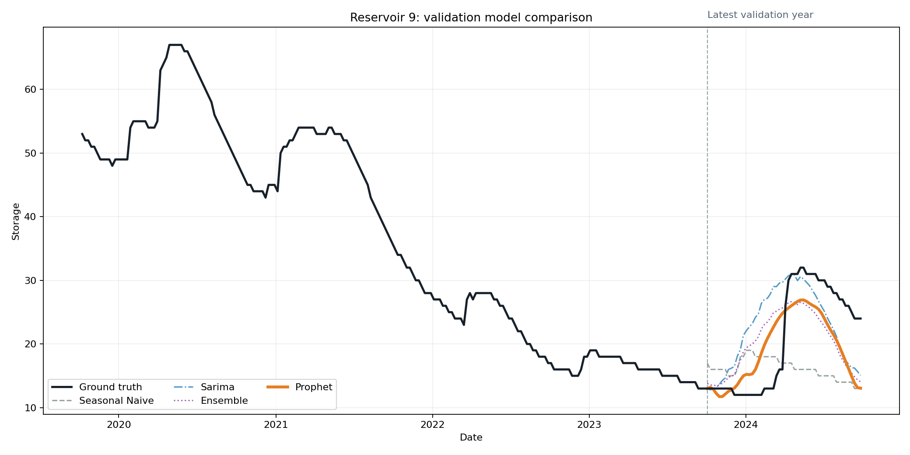

# Reservoir Storage Forecasting and Water Transfer Planning

This project forecasts how much water the reservoirs of Spain will store during the next year, and then plans which ones could give water to which ones. It reads public records, cleans and joins them into a single dataset, engineers features, fits several forecasting models per reservoir, compares those models on a validation split of reservoirs to pick the one to release, and applies a transfer planner that writes down every move it makes. I built it on my own in Python, and everything runs on one machine without a GPU.

The data modeling part started in Jupyter notebooks, and the final code is a command line interface that runs the same workflow. The notebooks live under `notebooks/` and the CLI is `backend/cli.py`.

<p align="center">
  
</p>
<p align="center"><em>Reservoir 9 (Viñuela, Málaga). Four years of observed weekly storage with the last validation year predicted by seasonal naive, SARIMA, Prophet and their fixed ensemble. Prophet is drawn thicker.</em></p>

The processed dataset covers 372 reservoirs with 652,754 weekly observations between 1987 and 2024. Extracting, cleaning, merging and building features takes about five seconds. Fitting Prophet costs around five seconds per reservoir, and after fitting once, the full forecast for the 75 Andalusian reservoirs loads from its cache in 0.15 seconds. Evaluation results are cached per reservoir and per origin, so an interrupted campaign continues where it stopped instead of refitting SARIMA, which needs around half an hour per reservoir.

Every number comes from public sources. The weekly storage series and the reservoir capacities come from the historical database of Spain's hydrological bulletin, Boletín Hidrológico, MITECO. The dam details, such as coordinates, riverbed, basin, crest elevation and height, come from the Inventory of Dams and Reservoirs, Inventario de Presas y Embalses, published by the same ministry. The lookup services cover what these downloads do not: the pages of embalses.net provide provinces that the inventory misses, Photon fills the coordinates it does not have, and Nominatim resolves the official names. Those services are free and shared with everybody. Here, each answer is saved to a local file the first time it arrives, so no question is ever asked twice.

## Pipeline

Every stage is one command of `backend/cli.py`, and each one reads only what the previous stage wrote:

1. `etl`: read the raw water, reservoir and detail files, normalize names and dates, join records that refer to the same reservoir, repair what geography allows, and merge everything into curated tables.
2. `features`: build lags, rolling means and standard deviations inside each reservoir, calendar fields, capacity fractions, and the value of the following week as the target.
3. `forecast`: fit the requested models for every reservoir, one by one or across worker processes, and write one year of predictions plus their ensemble.
4. `evaluate-validation` and `evaluate-test`: run three rolling origins of 52 weeks over the fixed evaluation splits, reusing finished work from cache.
5. `analyze-validation` and `analyze-test`: compare every candidate against the seasonal baseline and write the decision reports in Markdown and JSON.
6. `plan-transfers`: classify reservoirs from their forecasts and apply the transfer rule.

## Data engineering

Name matching is the hard part of joining these sources. Names are normalized by removing accents, symbols and Spanish articles, so "Embalse de La Viñuela" and "vinuela" collapse to the same key. Records repeated across sources are reconciled with alias tables and mapping lists reviewed by hand, declared as data in `settings.py` instead of buried in code. The same file holds the manual province fixes and the reviewed real names for the entries the lookup services miss.

Missing values are repaired only when geography justifies it. Absent capacities are filled with the maximum observed storage and flagged in a `capacity_imputed` column, and riverbed, crest elevation and basin are filled from the nearest neighbour by haversine distance and flagged the same way. Each series is rebuilt on a strict weekly grid, internal gaps are filled with the next observation and flagged in `storage_imputed`, reservoirs silent for more than two weeks are dropped, and storage never exceeds capacity. After cleaning, 401 reservoirs and 683 thousand observations survive. After the freshness filter and the merge, 372 reservoirs and 653 thousand do.

## Forecasting models

| Model | What it does | Ensemble weight |
| --- | --- | --- |
| seasonal naive | Repeats the last 52 observed weeks | 0.20 |
| SARIMA (1,1,1)(1,1,1)52 | Seasonal ARIMA on the weekly series | 0.50 |
| Prophet | Yearly seasonality, additive, changepoint prior 0.0005 | 0.30 |
| ensemble | Weighted average renormalized over the members available | — |

Forecasts start from the last observed value, negative predictions are lifted without changing the shape of the curve, and everything stays inside the physical range between zero and capacity. A model that fails to fit on one reservoir is skipped and recorded instead of aborting the batch.

## How the released model was chosen

Model selection never touches the test data. The 75 Andalusian reservoirs, which cover all eight provinces, were split once into 10 validation and 64 test reservoirs, with both ID lists stored in `settings.py`. One further reservoir lacks the history needed for three rolling origins and takes no part in the comparison. Evaluation walks three rolling origins of 52 weeks per reservoir, and reports MAE, RMSE and versions of both divided by capacity. MAPE is reported but not used for selection because it is unstable near empty reservoirs. The selection rule divides each metric by the seasonal naive mean and averages the four ratios into one composite score.

Validation results, ten reservoirs and three origins each:

| Model | MAE | RMSE | NMAE cap. | NRMSE cap. | Composite score |
| --- | --- | --- | --- | --- | --- |
| Prophet | 10.88 | 13.05 | 0.076 | 0.091 | **0.891** |
| ensemble | 11.00 | 13.03 | 0.076 | 0.091 | 0.896 |
| SARIMA | 11.31 | 13.57 | 0.079 | 0.095 | 0.929 |
| seasonal naive | 12.02 | 14.11 | 0.086 | 0.106 | 1.000 |

Prophet wins, but by 0.005 composite points over the ensemble, and ten reservoirs cannot separate them statistically. The tiebreaker is runtime. The released forecast runs every week over the whole population, and the ensemble inherits the cost of its most expensive member: SARIMA takes around half an hour per reservoir to fit, while Prophet fits in about five seconds. Paying that difference everywhere, forever, for a gap inside the noise was not worth it, so the release model is Prophet alone and the test split only ever runs Prophet.

The locked test contains 64 reservoirs with three origins each, 192 metric rows and no missing values. Mean NRMSE by capacity is 0.121, about twelve percent of an average reservoir's capacity, with median 0.106 and p95 of 0.262. Errors grow by a factor of 1.20 in raw MAE and 1.33 in normalized RMSE compared with validation. The worst case, reservoir 524 at 0.399, is documented in the test report.

## Transfer planning

The planner classifies each reservoir from its forecast distribution: the low quantile against capacity decides whether it is critical or worrying, and the median decides whether it can donate. A candidate transfer between two reservoirs moves the volume that equalizes both fill levels, capped at twenty five percent of the donor capacity and at the free space of the receiver, and its cost is distance divided by volume. The loop picks the cheapest feasible pair, applies the transfer, updates both reservoirs and writes one log row with donor, receiver, volume, distance, cost and the receiver status afterwards.

This phase moves one step at a time, because every applied transfer changes the next decision, so unlike forecasting it cannot be spread across workers per reservoir. In the latest run over all 75 Andalusian reservoirs there were 3 critical, 11 worrying and 60 eligible donors, but no pair passed the configured cost threshold, so zero transfers were applied and the log is legitimately empty. The final state stays inside physical bounds, with no negative storage and no reservoir above 93 percent full.

## Caching and runtime

Three cache layers keep the workflow cheap to repeat:

- The lookup files for scraping and geocoding, validated before reuse, keep every rerun offline.
- The forecast cache stores one Parquet file per reservoir named after the SHA-256 hash of its series, capacity, models and horizon, so unchanged input never fits again: loading all 75 release forecasts takes 0.15 seconds.
- The evaluation cache keeps a manifest per reservoir with configuration, completed origins and failures. `--limit` processes the next uncached reservoirs and stops, a second run resumes where the first stopped, and stale configurations are detected and excluded from summaries.

Forecasting is independent work per reservoir, so the release stage can spread it across processes with `--workers`. Each job reads or writes its own file in the forecast cache through an atomic replace, so two workers never touch the same file. Fitting Prophet for all 75 Andalusian reservoirs from a cold cache takes 149 seconds one by one, 85 seconds with two workers and 56 seconds with four, all on one laptop processor, and the parallel run writes files byte for byte identical to the sequential one. Planning stays sequential instead, for the reason given under Transfer planning.

| Workers | Cold forecast of 75 reservoirs | Speedup |
| --- | --- | --- |
| 1 | 149 s | 1.0x |
| 2 | 85 s | 1.8x |
| 4 | 56 s | 2.7x |

## Running it

With Python 3.11 or newer:

```text
python -m venv .venv
.\.venv\Scripts\Activate.ps1
python -m pip install -r requirements.txt
python -m pytest -q
```

GitHub Actions runs the test suite on every push.

Raw source files live outside the repository under a data root containing `raw/water.csv`, `raw/reservoirs.csv` and `raw/UTF8list-3.tsv`. The water and reservoir files are exports of the [Boletín Hidrológico historical database](https://www.miteco.gob.es/es/agua/temas/evaluacion-de-los-recursos-hidricos/boletin-hidrologico.html), and the detail file is an export of the [Inventory of Dams and Reservoirs](https://www.miteco.gob.es/es/cartografia-y-sig/ide/descargas/agua/inventario-presas-embalses.html) shapefile:

```text
python -m backend.cli --data-root <data root> etl
python -m backend.cli --data-root <data root> features
python -m backend.cli --data-root <data root> forecast --models prophet
python -m backend.cli --data-root <data root> forecast --models prophet --workers 4
python -m backend.cli --data-root <data root> evaluate-validation
python -m backend.cli --data-root <data root> analyze-validation
python -m backend.cli --data-root <data root> evaluate-test
python -m backend.cli --data-root <data root> analyze-test
python -m backend.cli --data-root <data root> plan-transfers --community andalucia --models prophet
python -m backend.cli --data-root <data root> report-validation --id 9
```

The same workflow runs in Docker. The image installs the pinned requirements on Python 3.12 and mounts any data root at `/data`, so the container reads and writes the same folders as a local run:

```text
docker compose build app
$env:RESERVOIR_DATA_ROOT = "C:\datasets\reservoir-dataset"
docker compose run --rm app etl
docker compose run --rm app forecast --models prophet --workers 4
```

`make-sample` generates a small synthetic dataset for feature and model smoke tests. The notebooks under `notebooks/` hold the exploratory phase: data quality analysis, experiments joining the tables and the first forecasting comparisons. They are development history. The supported workflow is the backend alone.

## Limitations

- The planner is a greedy heuristic. It says nothing about globally optimal allocation, and it leaves out evaporation, demands and the actual river network.
- Everything runs on one machine. The forecast stage now uses several cores, but it is still one node, and no distributed run has been made.
- The comparison of all three models exists only for the validation population, because the fit cost of SARIMA makes anything wider impractical here.
- External metadata depends on services maintained by others. The local caches remove that dependency for reruns and the request pace respects the services, but the two ministry files are downloaded by hand.
- Some joins rely on mappings reviewed by hand. They are explicit and versioned in `settings.py`, but they remain manual knowledge.
- Forecasts and plans support decisions. They are not operational water management advice.

## License

See `LICENSE.md`.
